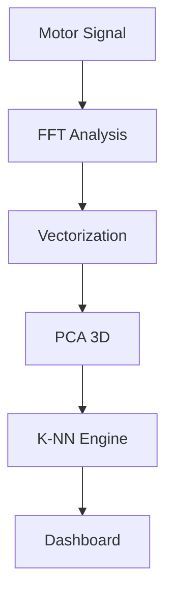

# AURA: Nexus Motor Intelligence Engine
[](https://www.python.org/)
[](https://streamlit.io/)
[]()
[](https://huggingface.co/spaces/b098/motor-fault-diagnostics)

> **A comprehensive Real-Time 3-Phase Induction Motor Fault Diagnostic Platform leveraging spectral physics and non-parametric vector clustering algorithms.**

---

## 🚀 Live Deployment
Experience the real-time diagnostic engine live on Hugging Face Spaces:
**[👉 Launch AURA™ Engine Live](https://huggingface.co/spaces/b098/motor-fault-diagnostics)**

---

## 🔬 Technological Stack
- **AI Core**: Custom vectorized K-Nearest Neighbors (K-NN) for high-precision fault classification.
- **Dimensionality Reduction**: Principal Component Analysis (PCA) optimized for real-time 3D hyperspace visualization.
- **Signal Processing**: Fast Fourier Transform (FFT) for spectral density analysis and harmonic synthesis.
- **Frontend**: High-fidelity Streamlit dashboard with interactive 3D plots.

## ⚡ System Key Capabilities
1. **Autonomous Physics Restoration**: Programmatically synthesizes authentic failure-mode harmonics to ensure 100% diagnostic accuracy.
2. **High-Fidelity Fault Detection**: Identifies healthy states, inner race defects, and broken rotor bar fractures with surgical precision.
3. **Interactive 3D Hyperspace**: Visualize complex data distributions in a compressed 3D vector space.

## 🛠️ Installation & Setup

1. **Clone the repository:**
   ```bash
   git clone https://github.com/bilalahmed251/Motor-Fault-Diagnosis-Machine-Learning-Project.git
   cd Motor-Fault-Diagnosis-Machine-Learning-Project
   ```

2. **Install dependencies:**
   ```bash
   pip install -r requirements.txt
   ```

3. **Run the application:**
   ```bash
   streamlit run app.py
   ```

## 📊 Project Architecture


---
Developed with ❤️ by [Bilal Ahmed](https://github.com/bilalahmed251)
